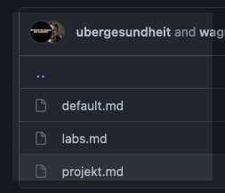

# Content Creation and Contrution

- [Manuelles Erstellen](#manuelles-erstellen)
  - [1 Auf zum codefor.de](#1-auf-zum-codeforde)
  - [2 Das Template](#2-das-template)
  - [3 Euer Inhalt](#3-euer-inhalt)
  - [4 Bilder](#4-bilder)
  - [5 Der pull request](#5-der-pull-request)  
- [The Terminal way](#the-terminal-way)

## Manuelles Erstellen

Voraussetzungen

- github account [github](https://github.com/join)

Und los gehts step by step

### 1 Auf zum codeforde

Navigiert zu [codefor.de](https://github.com/okfde/codefor.de) code repository

### 2 Das Template

Um sicherzustellen, dass dein Inhalt auch gefunden wird, benötigen wir ein paar Metadaten, aber wir lassen dich damit nicht allein. Unter `archetypes` findest du Templates für alle möglichen Inhalte  

  
  
  
  
wählt aus, was du erstellen willst und klickt anschließend auf `RAW`  
  
  
  
Der Metadaten Bereich ist umschlossen von `---`, kopier dir den Inhalt, den brauchen wir gleich!

### 3 Euer Inhalt

Gehe zurück auf start.. *nicht über los*  
Navigiere zu `codefor.de/content/` und wählt den Inhalt deiner Wahl aus (im Beispiel wird es `projekte` sein)  
  


Danach klicktst du auf `Add file` > `create new file`  
  


und gibst deinem Inhalt einen Namen nach dem Schema `Jahr`-`Monat`-`Tag`-`Tite`.md (YYYY-MM-DD-####.md)  
  


Jetzt brauchen wir die Metadaten aus dem Template wieder, einfach einfügen.
Für Projekte sieht das dann z.B. so aus:

``` yaml
---
layout: project #do not change
lab: [berlin] #change into your city/lab
imgname: #add file to assets/projects/your city
title: Titel #project title
status: Laufend
draft: true #set to 'false'


links:
- url: #add url
  name: Website
- url: #add url
  name: Code

---
<!--short project description here-->
```

**benutze bitte NICHT den Schnipsel hier**, die benötigten Metadaten können sich immer mal ändern und werden hier nicht nachgepflegt!

Alles über den `---` strichen, sind Metadaten, wir versuchen so gut wie möglich zu beschreiben, was da reinmuss.
Alles was hinter einem `#` bis zum Ende der Zeile steht, ist ein Kommentar den du löschen kannst, der dir beim Ausfüllen helfen soll.  
Alles was nach dem zweiten `---` steht, ist der Inhalt der Seite.

Der Inhalt wird in Markdown (commonmark) geschrieben, hier ist eine ausführliche [Referenz](https://spec.commonmark.org/0.29/) und hier eine [Kurzreferenz](https://commonmark.org/help/)

Wenn du mit tippen fertig bist oder eine Pause machst, scrollt ganz nach unten und klicke auf `Propose new file`.  
  
  
  
Jetzt passiert ganz viel **Black Magic** auf github
> es wird ein Fork von `okfde/codefor.de` in deinem Profil erstellt, auf dem Fork wir ein `branch` erstellt. Wenn du nichts mit git zu tun haben willst, kannst du die Terminologie aber einfach Ignorieren und zum Nächten schritt springen.

### 4 Bilder

Bei Blogposts brauchen wir unbedingt ein Bild, bei Labs und Projekten nicht.
Wenn du keine Bilder in deinem Artikel hast, springt einfach weiter zu **[5 Der pull request](#5-der-pull-request)**

Im Moment ist es etwas kompliziert, aber wir bekommen das hin. Der Schritt wird sich auch in naher Zukunft ändern.  

Als Erstes musst du den in schritt 3. erstellen Branch auswählen  
  


Alle Bilder werden im Moment im Ordner `static` gelagert also unter `static/projects` oder `static/blog` oder `static/labs`. Such dir den passenden Pfad zu deinem Artikel und klick auf `upload files`  
  


Anschließend auf `commit changes`  
  


### 5 Der pull request

Fast geschafft, nur noch der Pull Request.  

Github zeigt dir auf der Übersichtsseite direkt was zu tun ist! Klicke einfach auf `create Pull Request`  
  


Danach wirst du gebeten einen Titel und eine kurze Beschreibung einzugeben, das hilft dem Website-Team einfach zu entscheiden oder Feedback zu geben.  
  


Sobald du auf `Create Request` klickst, öffnet sich eine neue Seite und es laufen ein paar automatisierte Tests und es wird eine Vorschau der gesamten Seite erzeugt


Wenn in der markierten Zeile vorn ein grüner Haken ist, kannst du auf `Details` klicken und du landest auf der Vorschauseite!

> **Das war's!! Sobald der Inhalt freigegeben wird, ist er auf codefor.de sichtbar**

## The Terminal way

Voraussetzungen

- github account [join github](https://git-scm.com/book/de/v2/GitHub-Einrichten-und-Konfigurieren-eines-Kontos)
- lokale installation von git [quick start git](https://git-scm.com/book/en/v2/Getting-Started-Installing-Git)
- lokale installation von hugo [quick start hugo](https://gohugo.io/getting-started/installing/) **Achtung, wir benötigen `Hugo Extended`**

1. Das codeforde repository clonen `git clone https://github.com/okfde/codefor.de`
2. einen neuen branch anlegen `git checkout -b NEUER_BRANCH`
3. einen neuen Artikel anlegen (zb blogpost) `hugo new blog/JJJJ-MM-TT-einzigartigername.md` (inhalt siehe [3 Euer Inhalt](#3-euer-inhalt))
4. Mindestens ein Bild im Verzeichnis `static/blog` einfügen (bei Labs und Projekten nicht nötig) und den Dateinamen in den Metadaten im Blogpost unter `imgname` einfügen.
5. Mit `hugo -D` passiert ein wenig hugo magic und im `public` Ordner `blog/JJJJ-MM-TT-einzigartigername.html` ist dein Artikel wie er später auf der Website aussehen wird.
6. Dateien zu git hinzufügen `git add blog/JJJJ-MM-TT-einzigartigername.md blog/tollesbild.jpg`
7. commiten `git commit -m "Hier die Commit-Nachricht, z.B. add Blogeintrag zu xyz"`
8. pushen `git push`
9. Pull request stellen wie in [5 Der pull request](#5-der-pull-request)
